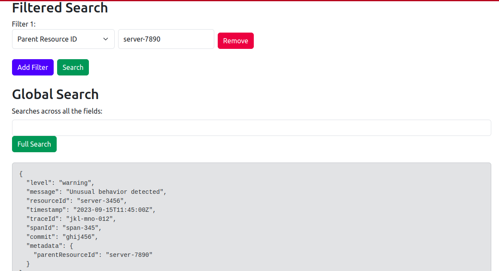
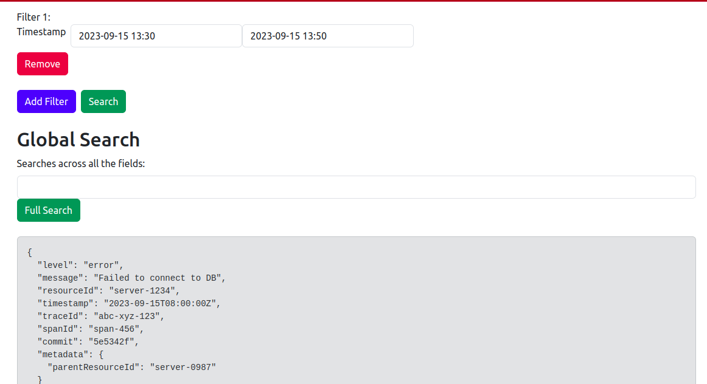

# Log Ingestor and Query Interface

## Problem Statement
Develop a log ingestor system that can efficiently handle vast volumes of log data, and offer a simple interface for querying this data using full-text search or specific field filters.

The requirements for the log ingestor and the query interface are specified below.

### Log Ingestor:

- Develop a mechanism to ingest logs in the provided format.
- Ensure scalability to handle high volumes of logs efficiently.
- Mitigate potential bottlenecks such as I/O operations, database write speeds, etc.
- Make sure that the logs are ingested via an HTTP server, which runs on port `3000` by default.

### Query Interface:

- Offer a user interface (Web UI or CLI) for full-text search across logs.
- Include filters based on:
    - level
    - message
    - resourceId
    - timestamp
    - traceId
    - spanId
    - commit
    - metadata.parentResourceId


### Advanced Features:

- Implement search within specific date ranges.
- Utilize regular expressions for search.
- Allow combining multiple filters.
- Provide real-time log ingestion and searching capabilities.
- Implement role-based access to the query interface.

## Technology tools/components used
- NodeJs
- React
- Elastic Search

## Getting Started

### Prerequisites
Make sure you have the following installed on your system:
- [Node.js](https://nodejs.org/)
- [npm](https://www.npmjs.com/)
- [Elasticsearch](https://www.elastic.co/)

### How to run Log Ingestor and Query Interface

1. Clone the repository from GitHub:

2. Install dependencies for both the server and client:

```bash
cd server
npm install
```
```bash
cd client
npm install
```
3. Run Elastic Search on your machine.

4. For running the log injestor, navigate to the `server` directory and start the log injestor:

```bash
cd server
node log-injestor.js
```
Note- The log ingester will be running on http://localhost:3000.

5. For running the log query interface , navigate to the `client` directory and start the reach app:

```bash
cd client
npm start
```

### Application Features

1. Log ingestion to Elasticsearch

2. Search logs based on filters


3. Search logs based on combination of filters using dynamic addition and removal of filters


4. Search logs based on timestamp


5. Search logs based on full-text search


### Why Elasticsearch

Elasticsearch is a powerful and versatile search and analytics engine. It is chosen for applications dealing with logs and searching due to its exceptional full-text search capabilities, flexibility, scalability, and rich set of features tailored for handling and analyzing log data efficiently.

Here in our application, The Log Query Interface uses Elasticsearch as its backend data store. Logs are ingested into the Elasticsearch index named `logs`. The application constructs Elasticsearch queries based on user filters and full-text search to retrieve relevant log data.


